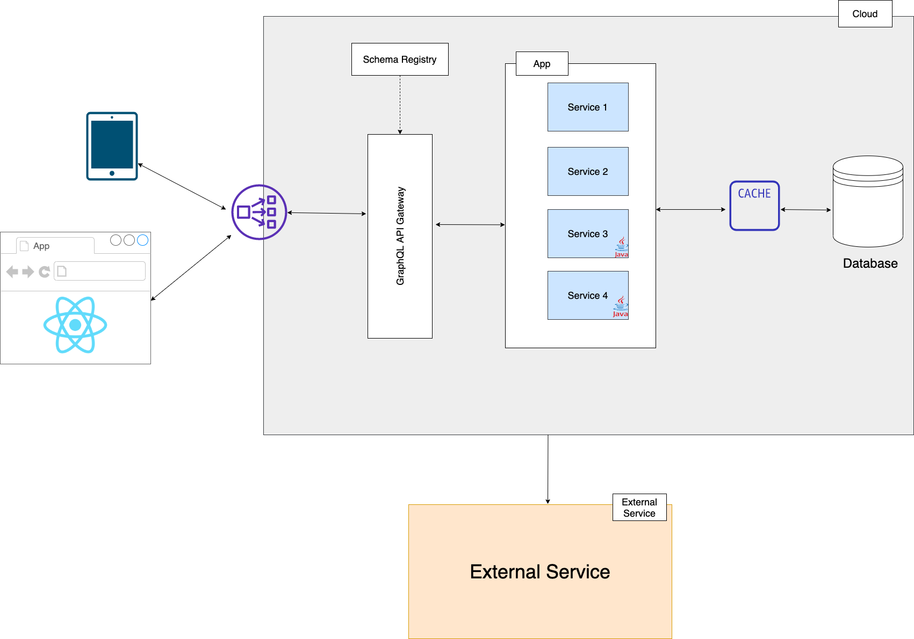

# [Project] Software Architecture

We plan to build the application using [Architecture] style. 

## Architecture Diagram

> We recommend building architecture using [Draw.io](https://app.diagrams.net/). Draw.io also has a desktop application.

You can also document your architecture using [C4Model](https://c4model.com/).  We recommend C1(System Context) and C2(Container) diagrams.

> C4 model is a lean graphical notation technique for modelling the architecture of software systems. It is based on a structural decomposition of a system into containers and components and relies on existing modelling techniques such as the Unified Modelling Language (UML) or Entity Relation Diagrams (ERD) for the more detailed decomposition of the architectural building blocks.

## Technologies

The list of technologies we will use to build the application are as follows:

| Technology          | Purpose                | Version  |
| ------------------- | ---------------------- | -------- |
| [Java]              | [Programming Language] | [11.0.9] |
| [Postgres]          | [Database]             | [13.1]   |
| [Backend Framework] | [Spring Boot]          | [2.4.1]  |
| [Frontend]          | [React]                | [17.0.1] |

## Non-functional Requirements

Non-functional requirement for the project are:

| Quality Attribute | Description                                                  | Target                                                       |
| ----------------- | ------------------------------------------------------------ | ------------------------------------------------------------ |
| [Performance]     | [Transaction Response Time]                                  | [2 seconds]                                                  |
| [Availability]    | [System Uptime]                                              | [99.9]                                                       |
| [Throughput]      | [Number of requests/transactions per second at peak time]    | [1000 RPS]                                                   |
| [Auditability]    | [Ability of the application to show what has happened to it, who did it and when] | [A log file that captures the event with the timestamp]      |
| [Reliability]     | [Mean time to recovery]                                      | [System should be able to recover from failure under 5 mins] |
| [Usability]       | [Usability can be described as the capacity of a system to provide a condition for its users to perform the tasks safely, effectively, and efficiently while enjoying the experience] | [Browsers: Chrome, IE, Firefox]  [Screen Size]          |

